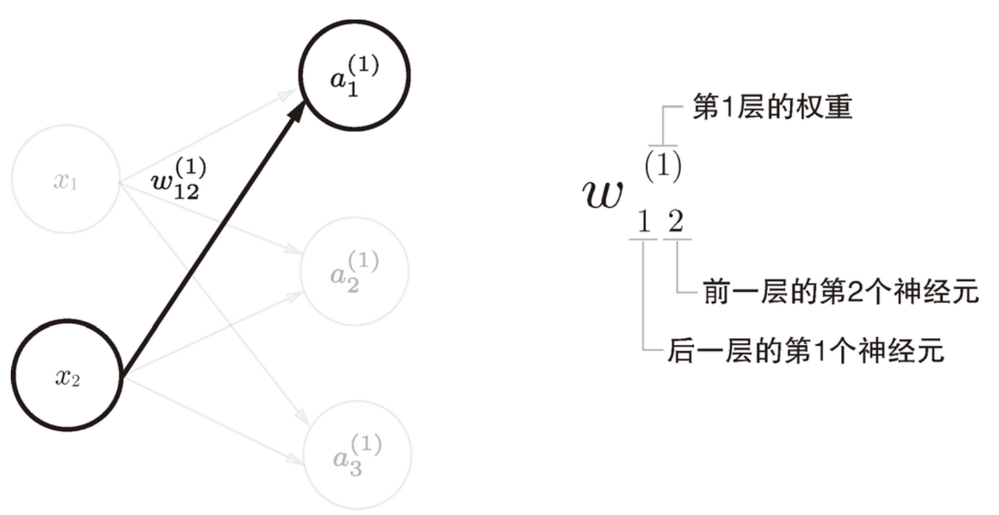
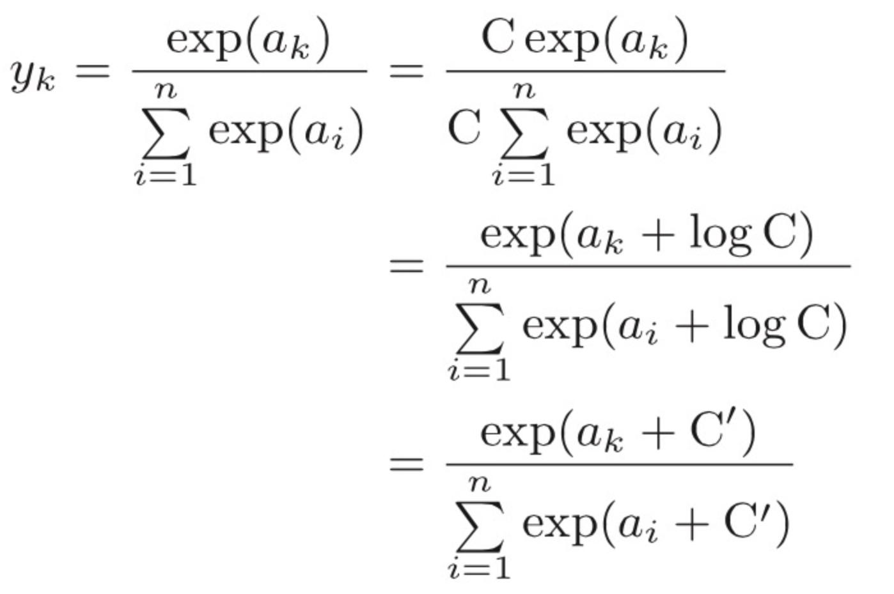

神经网络的激活函数必须使用非线性函数。换句话说，激活函数不能使用线性函数。为什么不能使用线性函数呢？因为使用线性函数的话，加深神经网络的层数就没有意义了。


权重和隐藏层的神经元的右上角有一个“(1)”，它表示权重和神经元的层号（即第 1 层的权重、第 1 层的神经元）。此外，权重的右下角有两个数字，它们是后一层的神经元和前一层的神经元的索引号.




输出层所用的激活函数，要根据求解问题的性质决定。一般地，回归问题可以使用恒等函数，二元分类问题可以使用 sigmoid 函数，多元分类问题可以使用 softmax 函数


#### 实现 softmax 函数时的注意事项

上面的 `softmax` 函数的实在运算上有一定的缺陷。这个缺陷就是溢出问题。softmax 函数的实现中要进行指数函数的运算，但是此时指数函数的值很容易变得非常大。比如，e10 的值会超过 20000，e100 会变成一个后面有 40 多个 0 的超大值，e1000 的结果会返回一个表示无穷大的 `inf`。如果在这些超大值之间进行除法运算，结果会出现“不确定”的情况。

在分子和分母上都乘上 C 这个任意的常数（因为同时对分母和分子乘以相同的常数，所以计算结果不变）。然后，把这个 C 移动到指数函数（exp）中，记为 log C。最后，把 log C 替换为另一个符号 C*'*。



```python
def softmax(a):
    c = np.max(a)
    exp_a = np.exp(a - c) # 溢出对策
    sum_exp_a = np.sum(exp_a)
    y = exp_a / sum_exp_a

    return y
```


