数值微分虽然简单，也容易实现，但缺点是计算上比较费时间。

误差反向传播法：一个能够高效计算权重参数的梯度的方法 

ReLU 层的作用就像电路中的开关一样。正向传播时，有电流通过的话，就将开关设为 ON；没有电流通过的话，就将开关设为 OFF。反向传播时，开关为 ON 的话，电流会直接通过；开关为 OFF 的话，则不会有电流通过。

### 激活函数层的实现

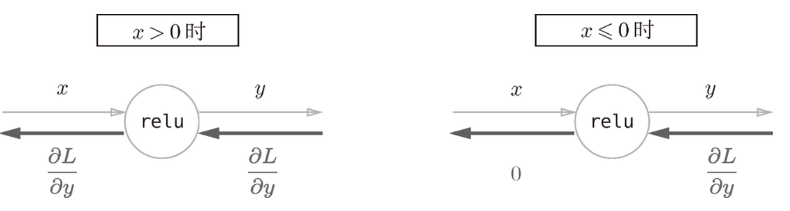

sigmoid层：

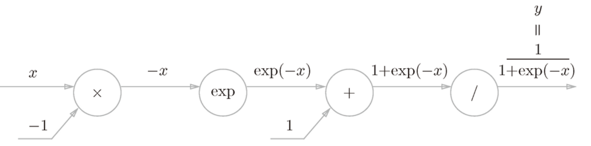

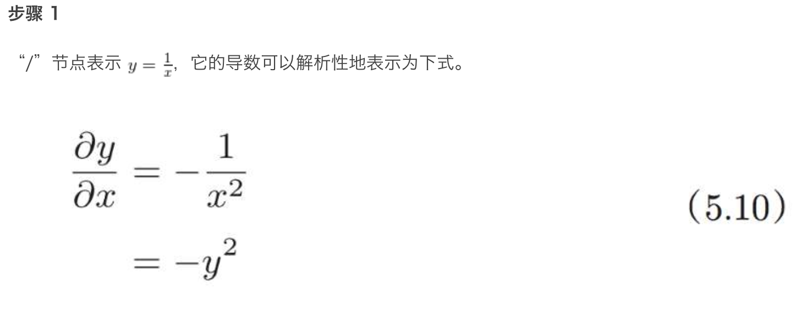

根据式（5.10），反向传播时，会将上游的值乘以 （正向传播的输出的平方乘以 -1 后的值）后，再传给下游。计算图如下所示。

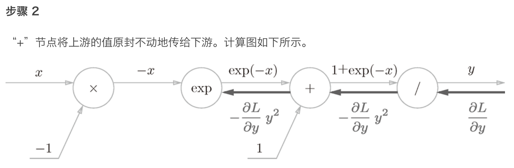

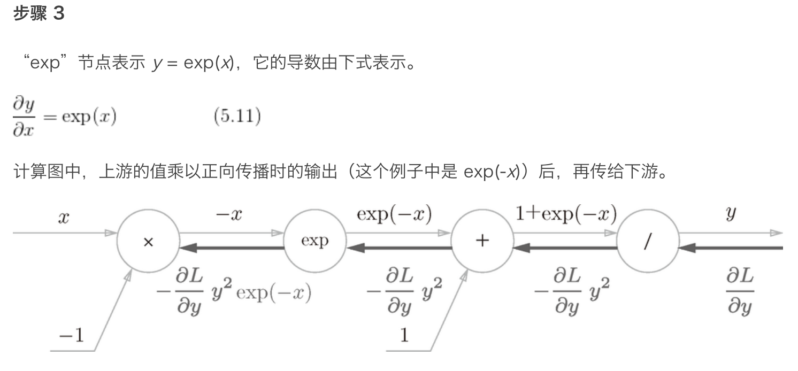

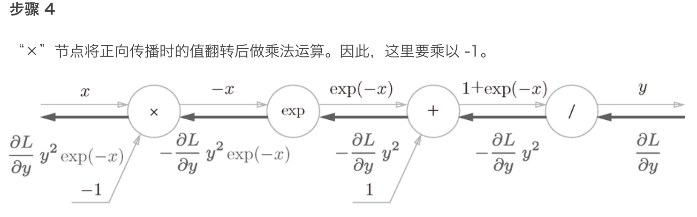

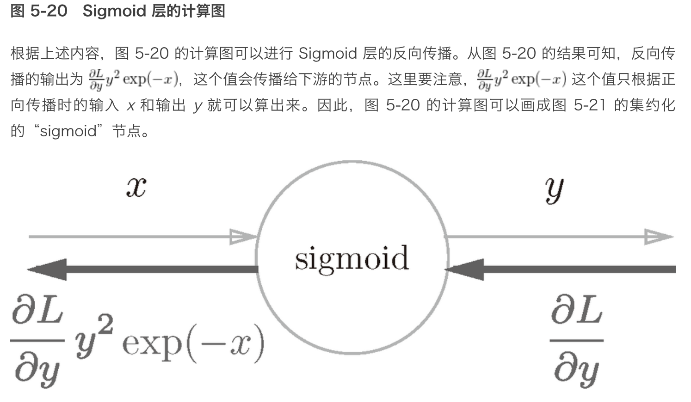

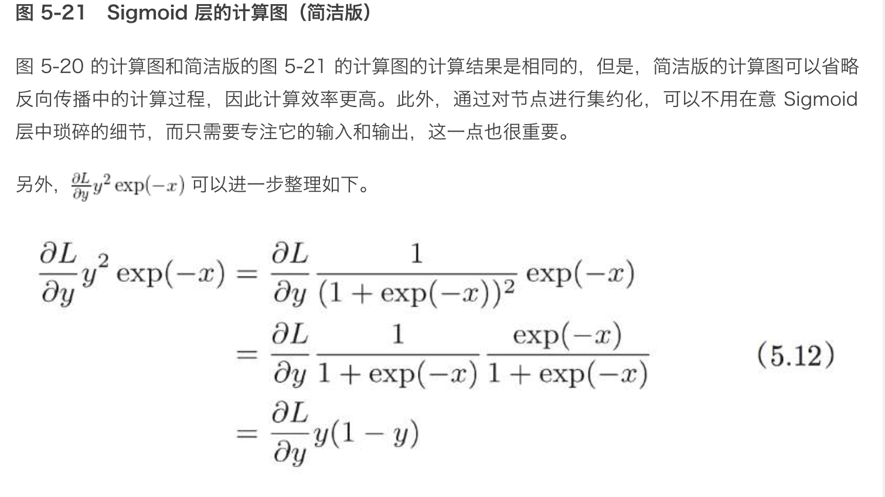

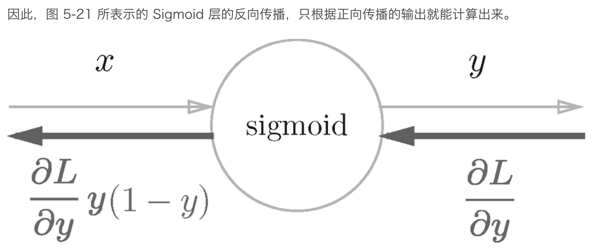

神经网络的正向传播中进行的矩阵的乘积运算在几何学领域被称为“仿射变换”{几何中，仿射变换包括一次线性变换和一次平移，分别对应神经网络的加权和运算与加偏置运算}。因此，这里将进行仿射变换的处理实现为“Affine 层”。

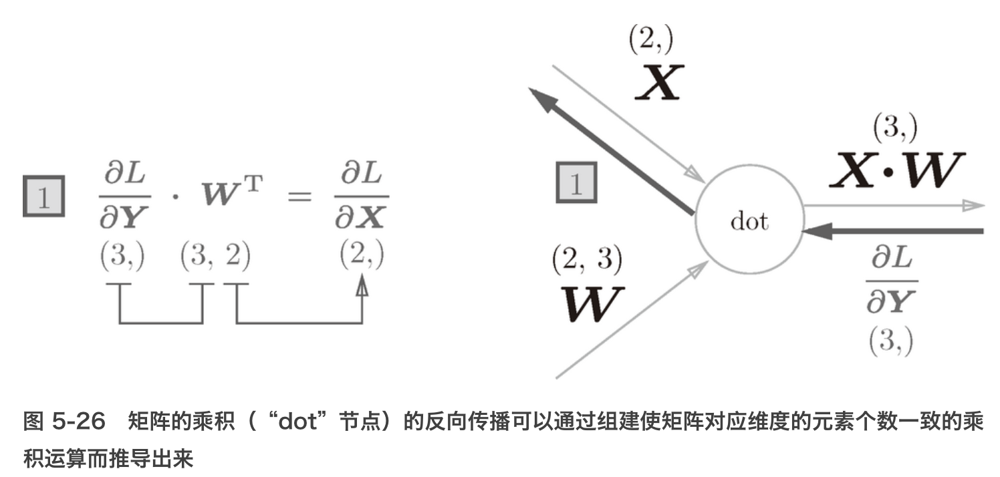

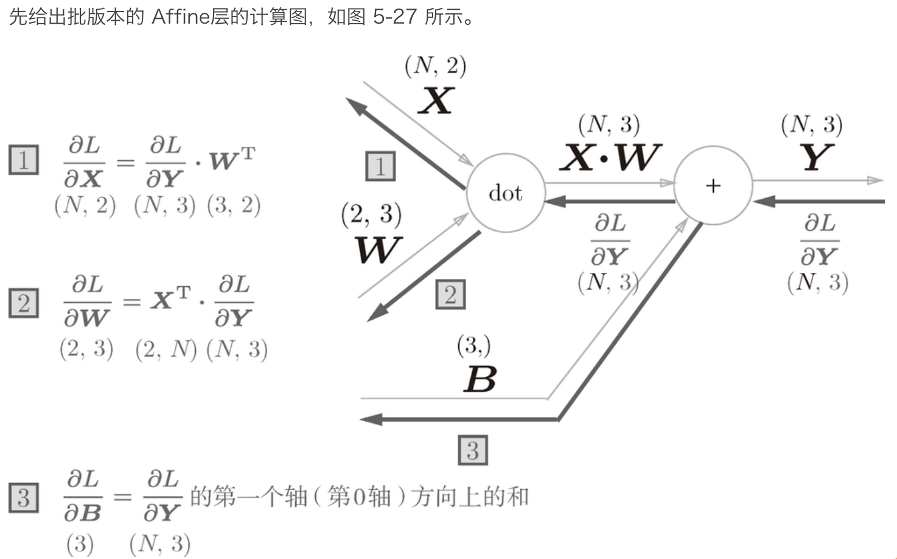

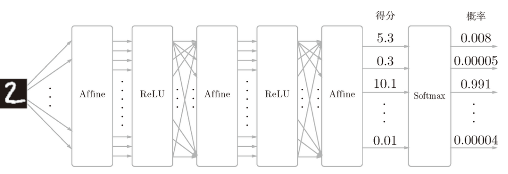

- 通过使用计算图，可以直观地把握计算过程。
- 计算图的节点是由局部计算构成的。局部计算构成全局计算。
- 计算图的正向传播进行一般的计算。通过计算图的反向传播，可以计算各个节点的导数。
- 通过将神经网络的组成元素实现为层，可以高效地计算梯度（反向传播法）。
- 通过比较数值微分和误差反向传播法的结果，可以确认误差反向传播法的实现是否正确（梯度确认）。