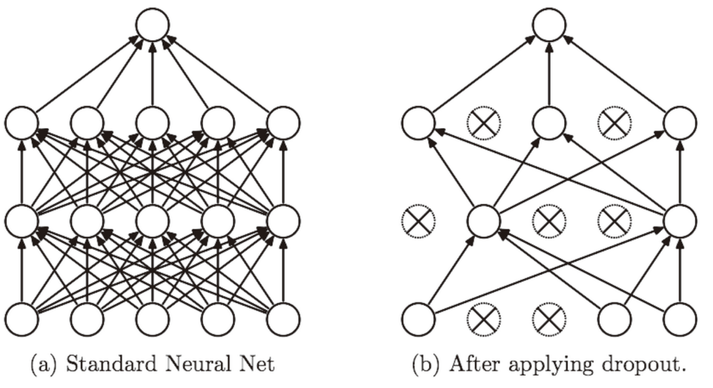

SGD 的缺点是，如果函数的形状非均向（anisotropic），比如呈延伸状，搜索的路径就会非常低效。因此，我们需要比单纯朝梯度方向前进的 SGD 更聪明的方法。SGD 低效的根本原因是，梯度的方向并没有指向最小值的方向。

低效sgd的示例

Momentum 是“动量”的意思，和物理有关。用数学式表示 Momentum 方法，如下所示。

图 6-5 中，更新路径就像小球在碗中滚动一样。和 SGD 相比，我们发现“之”字形的“程度”减轻了。这是因为虽然 *x* 轴方向上受到的力非常小，但是一直在同一方向上受力，所以朝同一个方向会有一定的加速。反过来，虽然 *y* 轴方向上受到的力很大，但是因为交互地受到正方向和反方向的力，它们会互相抵消，所以 *y* 轴方向上的速度不稳定。因此，和 SGD 时的情形相比，可以更快地朝 *x* 轴方向靠近，减弱“之”字形的变动程度。

#### AdaGrad

在神经网络的学习中，学习率（数学式中记为 *η*）的值很重要。学习率过小，会导致学习花费过多时间；反过来，学习率过大，则会导致学习发散而不能正确进行。

在关于学习率的有效技巧中，有一种被称为**学习率衰减**（learning rate decay）的方法，即随着学习的进行，使学习率逐渐减小。实际上，一开始“多”学，然后逐渐“少”学的方法，在神经网络的学习中经常被使用。

逐渐减小学习率的想法，相当于将“全体”参数的学习率值一起降低。而 AdaGrad [6] 进一步发展了这个想法，针对“一个一个”的参数，赋予其“定制”的值。

AdaGrad 会为参数的每个元素适当地调整学习率

AdaGrad 会记录过去所有梯度的平方和。因此，学习越深入，更新的幅度就越小。实际上，如果无止境地学习，更新量就会变为 0，完全不再更新。为了改善这个问题，可以使用 RMSProp   方法。RMSProp 方法并不是将过去所有的梯度一视同仁地相加，而是逐渐地遗忘过去的梯度，在做加法运算时将新梯度的信息更多地反映出来。这种操作从专业上讲，称为“指数移动平均”，呈指数函数式地减小过去的梯度的尺度。

#### Adam

Momentum 参照小球在碗中滚动的物理规则进行移动，AdaGrad 为参数的每个元素适当地调整更新步伐

直观地讲，Adam就是融合了 Momentum 和 AdaGrad 的方法。通过组合前面两个方法的优点，有望实现参数空间的高效搜索。此外，进行超参数的“偏置校正”也是 Adam 的特征

### 权重的初始值

在神经网络的学习中，权重的初始值特别重要。实际上，设定什么样的权重初始值，经常关系到神经网络的学习能否成功。本节将介绍权重初始值的推荐值，并通过实验确认神经网络的学习是否会快速进行。

Batch Norm，顾名思义，以进行学习时的 mini-batch 为单位，按 mini-batch 进行正规化。具体而言，就是进行使数据分布的均值为 0、方差为 1 的正规化。用数学式表示的话，如下所示。

**权值衰减**是一直以来经常被使用的一种抑制过拟合的方法。该方法通过在学习的过程中对大的权重进行惩罚，来抑制过拟合。很多过拟合原本就是因为权重参数取值过大才发生的。

神经网络的学习目的是减小损失函数的值。这时，例如为损失函数加上权重的平方范数（L2 范数）。这样一来，就可以抑制权重变大。用符号表示的话，如果将权重记为 **W**，L2 范数的权值衰减就是 ，然后将这个  加到损失函数上。这里，*λ* 是控制正则化强度的超参数。*λ*设置得越大，对大的权重施加的惩罚就越重。此外， 开头的  是用于将  的求导结果变成  的调整用常量。

作为抑制过拟合的方法，为损失函数加上权重的 L2 范数的权值衰减方法。该方法可以简单地实现，在某种程度上能够抑制过拟合。但是，如果网络的模型变得很复杂，只用权值衰减就难以应对了。在这种情况下，我们经常会使用 Dropout 方法。

Dropout 是一种在学习的过程中随机删除神经元的方法。训练时，随机选出隐藏层的神经元，然后将其删除。被删除的神经元不再进行信号的传递，如图 6-22 所示。训练时，每传递一次数据，就会随机选择要删除的神经元。然后，测试时，虽然会传递所有的神经元信号，但是对于各个神经元的输出，要乘上训练时的删除比例后再输出。

Embedding层，在某种程度上，就是用来降维的，降维的原理就是矩阵乘法。在卷积网络中，可以理解为特殊全连接层操作，跟1x1卷积核异曲同工

总结：

- 参数的更新方法，除了 SGD 之外，还有 Momentum、AdaGrad、Adam 等方法。
- 权重初始值的赋值方法对进行正确的学习非常重要。
- 作为权重初始值，Xavier 初始值、He 初始值等比较有效。
- 通过使用 Batch Normalization，可以加速学习，并且对初始值变得健壮。
- 抑制过拟合的正则化技术有权值衰减、Dropout 等。
- 逐渐缩小“好值”存在的范围是搜索超参数的一个有效方法。