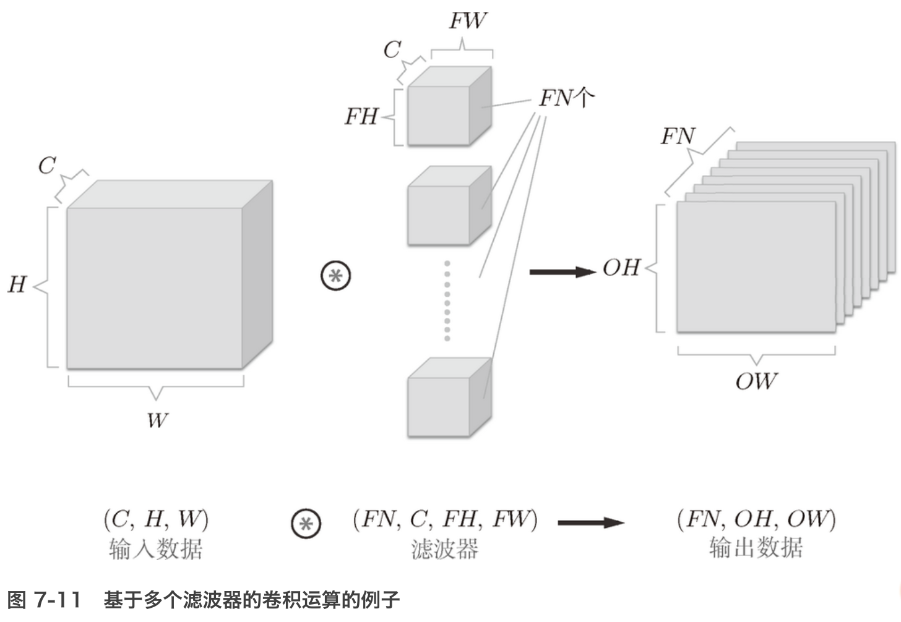

CNN 中，有时将卷积层的输入输出数据称为**特征图**（feature map）。其中，卷积层的输入数据称为**输入特征图**（input feature map），输出数据称为**输出特征图**（output feature map）。

在进行卷积层的处理之前，有时要向输入数据的周围填入固定的数据（比如 0 等），这称为**填充**（padding）

应用滤波器的位置间隔称为**步幅**（stride）

多通道卷积过程

通道数为 *C*、高度为 *H*、长度为 *W* 的数据的形状可以写成（*C*, *H*, *W*）。滤波器也一样，要按（channel, height, width）的顺序书写。比如，通道数为 *C*、滤波器高度为 *FH*（Filter Height）、长度为 *FW*（Filter Width）时，可以写成（*C*, *FH*, *FW*）。

###Pooling:

池化是缩小高、长方向上的空间的运算

除了 Max 池化之外，还有 Average 池化等。相对于 Max 池化是从目标区域中取出最大值，Average 池化则是计算目标区域的平均值。在图像识别领域，主要使用 Max 池化

**没有要学习的参数**

池化层和卷积层不同，没有要学习的参数。池化只是从目标区域中取最大值（或者平均值），所以不存在要学习的参数。

**通道数不发生变化**:输入数据发生微小偏差时，池化仍会返回相同的结果。因此，池化对输入数据的微小偏差具有鲁棒性

经过池化运算，输入数据和输出数据的通道数不会发生变化

AlexNet:

- CNN 在此前的全连接层的网络中新增了卷积层和池化层。
- 使用`im2col`函数可以简单、高效地实现卷积层和池化层。
- 通过 CNN 的可视化，可知随着层次变深，提取的信息愈加高级。
- LeNet 和 AlexNet 是 CNN 的代表性网络。
- 在深度学习的发展中，大数据和 GPU 做出了很大的贡献。