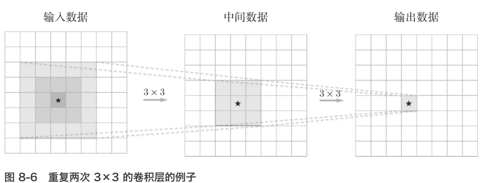
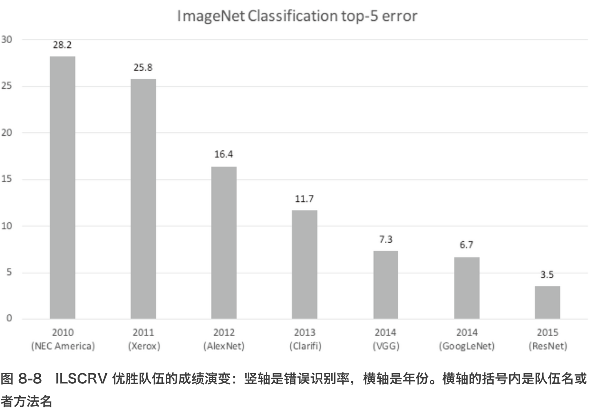
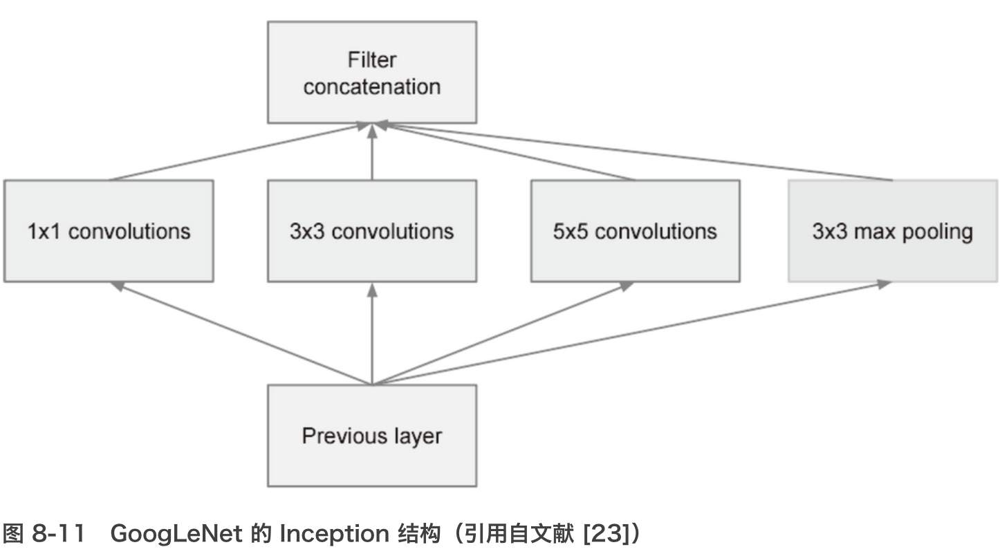
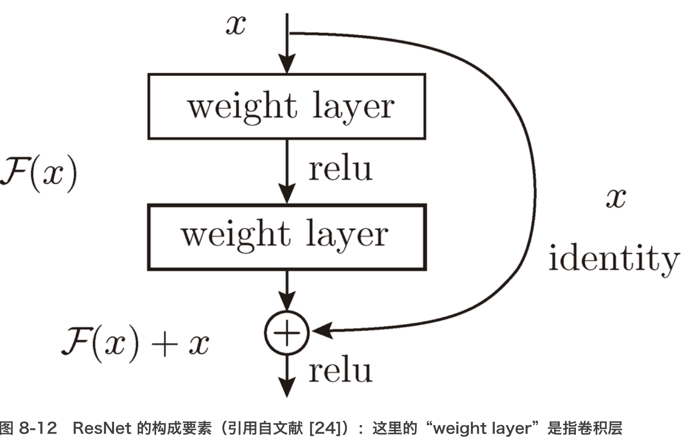

一次 5 × 5 的卷积运算的区域可以由两次 3 × 3 的卷积运算抵充。并且，相对于前者的参数数量 25（5 × 5），后者一共是 18（2 × 3 × 3），通过叠加卷积层，参数数量减少了。而且，这个参数数量之差会随着层的加深而变大。比如，重复三次 3 × 3 的卷积运算时，参数的数量总共是 27。而为了用一次卷积运算“观察”与之相同的区域，需要一个 7 × 7 的滤波器，此时的参数数量是 49。

叠加小型滤波器来加深网络的好处是可以减少参数的数量，扩大**感受野**（receptive field，给神经元施加变化的某个局部空间区域）。并且，通过叠加层，将 ReLU 等激活函数夹在卷积层的中间，进一步提高了网络的表现力。这是因为向网络添加了基于激活函数的“非线性”表现力，通过非线性函数的叠加，可以表现更加复杂的东西。

深度学习历史：

ImageNet[25] 是拥有超过 100 万张图像的数据集，它包含了各种各样的图像，并且每张图像都被关联了标签（类别名）。每年都会举办使用这个巨大数据集的 ILSVRC 图像识别大赛。

2012 年的 AlexNet

2015 年的 ResNet（一个超过 150 层的深度网络）

VGG 是由卷积层和池化层构成的基础的 CNN，它的特点在于将有权重的层（卷积层或者全连接层）叠加至 16 层（或者 19 层），具备了深度（根据层的深度，有时也称为“VGG16”或“VGG19”）。

VGG 在 2014 年的比赛中最终获得了第 2 名的成绩（下一节介绍的 GoogleNet 是 2014 年的第 1 名）。虽然在性能上不及 GoogleNet，但因为 VGG 结构简单，应用性强，所以很多技术人员都喜欢使用基于 VGG 的网络。

GoogLeNet 的特征是，网络不仅在纵向上有深度，在横向上也有深度（广度）。GoogLeNet 在横向上有“宽度”，这称为“Inception 结构”

Inception 结构使用了多个大小不同的滤波器（和池化），最后再合并它们的结果。GoogLeNet 的特征就是将这个 Inception 结构用作一个构件（构成元素）。此外，在 GoogLeNet 中，很多地方都使用了大小为 1 × 1 的滤波器的卷积层。这个 1 × 1 的卷积运算通过在通道方向上减小大小，有助于减少参数和实现高速化处理

ResNet是微软团队开发的网络。它的特征在于具有比以前的网络更深的结构。

在连续 2 层的卷积层中，将输入 *x* 跳着连接至 2 层后的输出。这里的重点是，通过快捷结构，原来的 2 层卷积层的输出 f(x) 变成了 f(x)+x。通过引入这种快捷结构，即使加深层，也能高效地学习。这是因为，通过快捷结构，反向传播时信号可以无衰减地传递。

因为快捷结构只是原封不动地传递输入数据，所以反向传播时会将来自上游的梯度原封不动地传向下游。这里的重点是不对来自上游的梯度进行任何处理，将其原封不动地传向下游。因此，基于快捷结构，不用担心梯度会变小（或变大），能够向前一层传递“有意义的梯度”。通过这个快捷结构，之前因为加深层而导致的梯度变小的梯度消失问题就有望得到缓解。

实践中经常会灵活应用使用 ImageNet 这个巨大的数据集学习到的权重数据，这称为**迁移学习**，将学习完的权重（的一部分）复制到其他神经网络，进行再学习（fine tuning）。比如，准备一个和 VGG 相同结构的网络，把学习完的权重作为初始值，以新数据集为对象，进行再学习。迁移学习在手头数据集较少时非常有效。

GPU 原本是作为图像专用的显卡使用的，但最近不仅用于图像处理，也用于通用的数值计算。由于 GPU 可以高速地进行并行数值计算，因此 **GPU 计算**的目标就是将这种压倒性的计算能力用于各种用途。所谓 GPU 计算，是指基于 GPU 进行通用的数值计算的操作。

通过 `im2col` 可以将卷积层进行的运算转换为大型矩阵的乘积。这个 `im2col` 方式的实现对 GPU 来说是非常方便的实现方式。这是因为，相比按小规模的单位进行计算，GPU 更擅长计算大规模的汇总好的数据。也就是说，通过基于 `im2col` 以大型矩阵的乘积的方式汇总计算，更容易发挥出 GPU 的能力。

一个基于深度学习生成图像标题的代表性方法是被称为 NIC（Neural Image Caption）的模型

NIC 由深层的 CNN 和处理自然语言的 RNN（Recurrent Neural Network）构成。RNN 是呈递归式连接的网络，经常被用于自然语言、时间序列数据等连续性的数据上。

> RNN 的 R 表示 Recurrent（递归的）。这个递归指的是神经网络的递归的网络结构。根据这个递归结构，神经网络会受到之前生成的信息的影响（换句话说，会记忆过去的信息），这是 RNN 的特征。比如，生成“我”这个词之后，下一个要生成的词受到“我”这个词的影响，生成了“要”；然后，再受到前面生成的“我要”的影响，生成了“睡觉”这个词。对于自然语言、时间序列数据等连续性的数据，RNN 以记忆过去的信息的方式运行。

**基于 DCGAN 生成的新的卧室图像**

DCGAN 中使用了深度学习，其技术要点是使用了 Generator（生成者）和 Discriminator（识别者）这两个神经网络。Generator 生成近似真品的图像，Discriminator 判别它是不是真图像（是 Generator 生成的图像还是实际拍摄的图像）。像这样，通过让两者以竞争的方式学习，Generator 会学习到更加精妙的图像作假技术，Discriminator 则会成长为能以更高精度辨别真假的鉴定师。两者互相切磋、共同成长，这是 **GAN**（Generative Adversarial Network）这个技术的有趣之处。在这样的切磋中成长起来的 Generator 最终会掌握画出足以以假乱真的图像的能力（或者说有这样的可能）。

**Deep Q-Network（强化学习）**

就像人类通过摸索试验来学习一样（比如骑自行车），让计算机也在摸索试验的过程中自主学习，这称为**强化学习**（reinforcement learning）

强化学习的基本框架是，代理（Agent）根据环境选择行动，然后通过这个行动改变环境。根据环境的变化，代理获得某种报酬。强化学习的目的是决定代理的行动方针，以获得更好的报酬